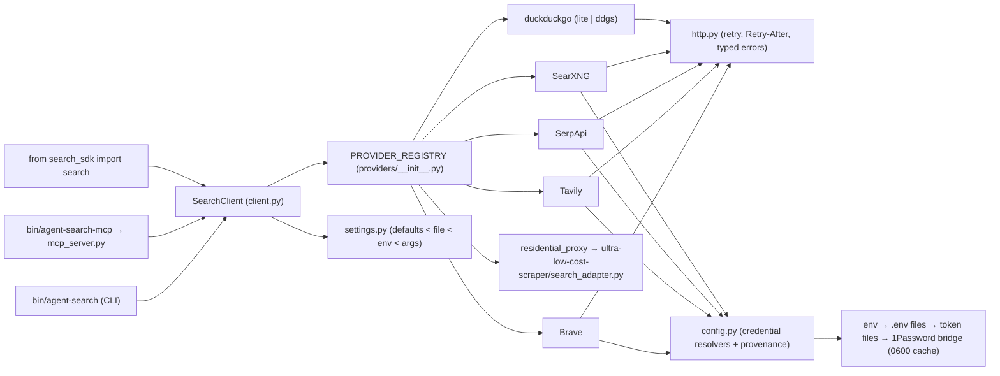

# System Architecture Map - 26.09.03-agent-search-sdk

> One-page app/system map. Read before API tracing, feature planning, or
> architecture-impacting edits; update in the same work block when modules,
> integrations, config ownership, or runtime change.

## App Summary

- What this app does: one fail-open web-search entry point for autonomous agents — Python SDK (`search_sdk`), CLI (`agent-search`), MCP server (`agent-search`) — over a configurable provider cascade with parallel RRF fusion.
- Primary users: local agents (Claude Code, Antigravity, Codex) and skills that need a search that never crashes on quota/429/timeout/bot-challenge.
- Core jobs: cascade search, fusion search, provider health (`doctor`), credential auto-discovery with provenance, effective-config introspection.
- Out of scope: page fetching/scraping, site-specific logged-in search (→ `smart-search`/opencli), neural search (→ `exa-search`).
- Current phase: v1.1.0 shipped 2026-09-04 (real-page debug pass, settings layer, honest tests).
- last_verified: 2026-09-04 — `python3 run_tests.py` 86/86, `tests/test_live.py` 9/9, `doctor --live` 6/6, MCP `tools/call agent_search` answered.

## System Diagram

## Module Map

| Module / Area | Owns | Reads | Writes | Public Contract | Source Paths |
| --- | --- | --- | --- | --- | --- |
| Settings | every tunable + credential *routes*; precedence; provenance; warnings | `$AGENT_SEARCH_CONFIG` / `~/.config/agent-search-sdk/config.json`, env | config file on `config init` only | `get_settings()`, `load_settings()`, `Settings.get/path/resolve_cascade`, `write_example_config()` | `search_sdk/settings.py` |
| Credentials | value discovery with source labels; 1Password memo/cache | env, `.env` files, token files, `op_unattended.py` | `~/.cache/agent-search-sdk/credentials_cache.json` (0600, only when non-empty) | `resolve_brave()/brave_api_key()`, `resolve_serpapi_keys()`, `resolve_searxng_cf_access()`, `credential_provenance()` | `search_sdk/config.py` |
| Transport | retries on 429/503 honouring `Retry-After`, typed errors, UA | settings `http.*` | — | `request()`, `RetryPolicy`, `HTTPStatusError`, `TransportError` | `search_sdk/http.py` |
| Providers | one class per engine, normalised `SearchResult` | settings `providers.<name>`, credentials | — | `BaseSearchProvider.search/is_configured/health_check`; `PROVIDER_REGISTRY` | `search_sdk/providers/*.py` |
| Client | cascade + fusion, presets, skip/raise semantics | settings presets | — | `SearchClient.search/quick_search/register_provider/doctor`, `provider_names()` | `search_sdk/client.py` |
| Doctor | health report, cascade, credential provenance | client, config | — | `run_doctor(live)` | `search_sdk/doctor.py` |
| CLI | `query` (default), `doctor`, `config show/init/path`, `--version` | argv, settings | config file on `init` | exit 0/1/2 | `search_sdk/cli.py`, `bin/agent-search` |
| MCP | stdio server; mcp 1.x `FastMCP` / 2.x `MCPServer` | same as client | — | tools `agent_search`, `agent_search_doctor`, `agent_search_config` | `search_sdk/mcp_server.py`, `bin/agent-search-mcp` |

## Data And Storage

| Store | Owns | Producer | Consumer | Source Of Truth | Notes |
| --- | --- | --- | --- | --- | --- |
| `~/.config/agent-search-sdk/config.json` | non-secret settings | user / `config init` | settings | user | absent = defaults |
| `~/.cache/agent-search-sdk/credentials_cache.json` | 1Password resolve memo (24h) | config | config | 1Password | 0600; never written empty |
| `~/.config/agent-search-sdk/searxng_token.json` | SearXNG CF Access token | cloudflare-dns-manager setup | config | Cloudflare Zero Trust | 100-year token, expires 2126 |
| `tests/fixtures/*.html` | real captured DuckDuckGo pages (200 organic+ads; 202 anomaly) | this repo | tests | live capture 2026-09-04 | re-capture if parser drifts |

## Integrations And External Services

| Service | Purpose | Auth / Secret Route | Owner Module | Failure Mode | Verification |
| --- | --- | --- | --- | --- | --- |
| Brave Search API | tier 1 | `BRAVE_API_KEY` (env / .env / 1Password `Brave API (skill backup)`) | providers/brave | 429 at >1 req/s → 1 retry w/ Retry-After | last_verified 2026-09-04 live |
| Tavily | tier 1 (LLM snippets) | `TAVILY_API_KEY` | providers/tavily | 429/402 → skip | 2026-09-04 live |
| SerpApi | Google SERP, key pool | `SERPAPI_API_KEYS`/`SERPAPI_API_KEY`, 1Password ×3 | providers/serpapi | quota → rotate key | 2026-09-04 live |
| SearXNG `search.worldinspirelab.com` | $0 granary | CF Access `client_id`+`credential` (token file / 1Password) | providers/searxng | HTML/redirect = bad token; engine CAPTCHA = 0 results | 2026-09-04 live |
| ultra-low-cost-scraper | residential proxy (DataImpulse, chrome120) | resolved inside the skill (`proxy_resolver`) | providers/residential_proxy | adapter missing → unconfigured | 2026-09-04 live |
| DuckDuckGo Lite / `ddgs` | zero-key floor | none | providers/duckduckgo | HTTP 202 anomaly → named error, skipped | 2026-09-04 live (organic) |

## Runtime And Deployment

| Surface | Runtime | Entry Command / URL | Config Source | Health Check | Owner |
| --- | --- | --- | --- | --- | --- |
| CLI | system `python3` (3.10+, pydantic only) | `~/.local/bin/agent-search` → `bin/agent-search` | settings + credentials | `agent-search doctor --live` | V |
| MCP | repo `.venv` (uv, Python 3.13, mcp 2.1) or any interpreter with mcp | `bin/agent-search-mcp` | same | `tests/test_mcp_process.py` | V |
| Package | wheel via `uv build` | `pip install .[mcp,ddg]` | same | `operations/health-checks.md` packaging row | V |

## Update Triggers

- New provider → registry entry + unit fixture + `test_live_<name>` (gate enforces) + rows here.
- New setting or credential route → `settings.DEFAULTS` + `references/config.md` in the skill.
- Provider API/page drift → re-capture fixture, fix parser, note in `CHANGELOG.md`.

## Open Questions

- Global MCP registration in Claude / Antigravity config is documented but not applied (persistent config change; user's call).
- `ddgs` backend verified live 2026-09-04 (3 organic rows, 10.4 s) in the repo `.venv`; the system-Python CLI stays on Lite. `auto` = Lite first, `ddgs` on challenge.
